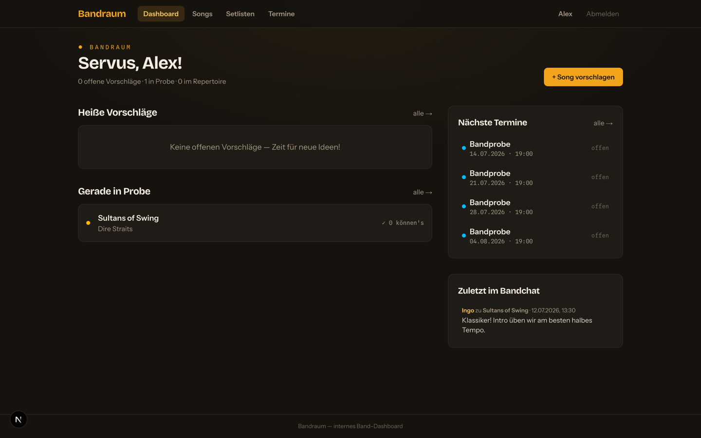
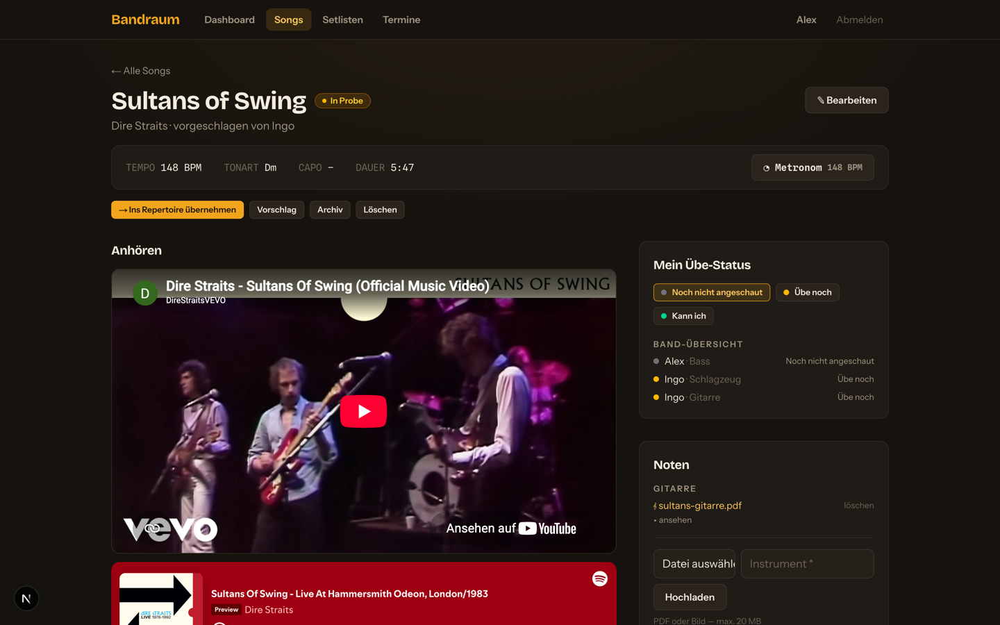
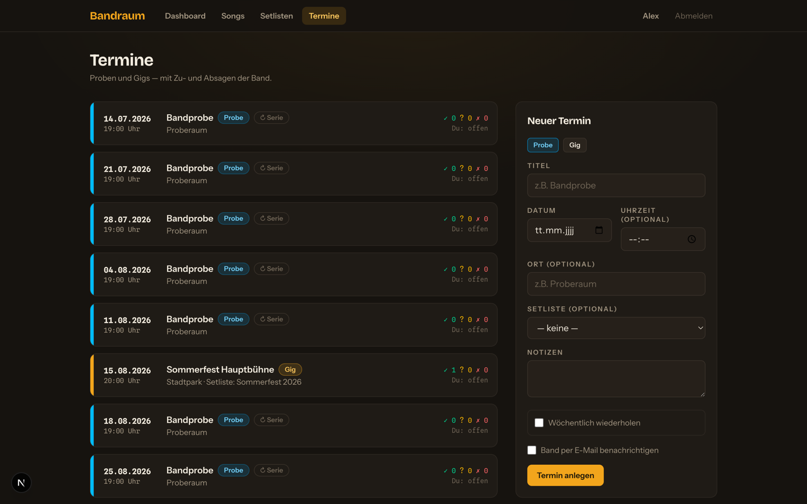

# Bandraum

Selbst gehostetes Band-Dashboard: Songvorschläge mit Voting, Noten & Audio pro Song, Übe-Status, Bandchat, Setlisten, Probetermine mit Zu-/Absagen — alles an einem Ort, gebaut für kleine Bands (3–15 Leute).

> **English:** Bandraum ("band room") is a self-hosted dashboard for bands: song suggestions with voting, sheet music & audio per song, practice status, comments, drag-and-drop setlists with print view, rehearsal/gig scheduling with RSVPs, an ICS calendar feed, a built-in metronome and a chord transposer. Single Node.js process, SQLite, no external services required. UI is currently German only — contributions welcome.

**Stack:** Next.js (App Router) · SQLite (better-sqlite3 + Drizzle) · Tailwind CSS · iron-session — läuft als einzelner Node-Prozess, keine externen Dienste nötig.



<table>
  <tr>
    <td></td>
    <td></td>
  </tr>
</table>

## Features

- **Songs** mit Status-Workflow: Vorschlag → In Probe → Repertoire → Archiv
- Tempo (BPM), Tonart, Capo, Dauer, Lyrics/Akkorde, Notizen
- **Uploads**: Noten pro Instrument (PDF/Bilder, max. 20 MB) und Audio-Dateien (max. 50 MB) mit Player
- **Links** mit YouTube-/Spotify-Embed
- **Voting** (Daumen hoch/runter) auf Vorschläge
- **Übe-Status** pro Mitglied („Noch nicht angeschaut / Übe noch / Kann ich")
- **Bandchat**: Kommentare pro Song
- **Setlisten** mit Drag-&-Drop-Reihenfolge, Gesamtdauer und Druck-/PDF-Ansicht
- **Metronom** (Web Audio) mit Tap-Tempo, vorbelegt mit dem Song-Tempo
- **Userverwaltung**: Admin legt Mitglieder an und setzt Passwörter; sonst dürfen alle alles
- Optionale **E-Mail-Benachrichtigung** bei neuem Vorschlag/Kommentar (SMTP), pro User abschaltbar

- **Termine**: Proben (auch als wöchentliche Serie) und Gigs mit Zu-/Absagen der Mitglieder, optionaler E-Mail beim Anlegen, Setlisten-Verknüpfung
- **PDF-Noten-Viewer** direkt auf der Songseite
- **Transponieren**: Akkordzeilen in den Lyrics live um Halbtöne verschieben (deutsch H/B und englisch B unterstützt), optional dauerhaft speichern

Die vollständige Feature-Liste inkl. priorisierter Roadmap steht in **[FEATURES.md](FEATURES.md)**.

## Lokal starten

```bash
npm install
cp .env.example .env        # SESSION_SECRET setzen!
npm run seed                # legt den ersten Admin an (gibt Passwort aus)
npm run dev                 # http://localhost:3000
```

`npm run seed` liest optional `ADMIN_NAME`, `ADMIN_EMAIL`, `ADMIN_PASSWORD` aus der Umgebung/.env; ohne Angabe wird `admin@example.com` mit Zufallspasswort angelegt (wird in der Konsole ausgegeben). Nach dem ersten Login das Passwort im Profil ändern.

## Daten

Alle persistenten Daten liegen in `data/` (per `DATA_DIR` konfigurierbar):

- `data/band.db` — SQLite-Datenbank (WAL-Modus)
- `data/uploads/<songId>/…` — hochgeladene Dateien

**Backup = dieses Verzeichnis sichern.** Es liegt nicht im Git.

Schema-Änderungen: `lib/db/schema.ts` anpassen, dann `npm run db:generate` — die Migration in `drizzle/` wird beim nächsten App-Start automatisch angewendet.

## Produktiv-Deployment

Die App läuft als **ein** Node-Prozess (Next.js `next start`) unter [PM2](https://pm2.keymetrics.io/), standardmäßig auf **Port 8059**, und wird üblicherweise über einen Reverse-Proxy (nginx/Apache) mit HTTPS nach außen gestellt. Voraussetzung: Node ≥ 20 und PM2 (`npm install -g pm2`) auf dem Server.

### 1. Erstinstallation

```bash
git clone https://github.com/iDobrounig/BandMate.git
cd BandMate
cp .env.example .env          # anschließend ausfüllen (siehe unten)
npm install
npm run build
npm run seed                  # nur beim ersten Mal — legt den Admin an (Passwort wird ausgegeben)
```

Pflicht- und optionale Werte in der `.env`:

| Variable | | Zweck |
|---|---|---|
| `SESSION_SECRET` | **Pflicht** | Session-Verschlüsselung, mind. 32 Zeichen: `openssl rand -base64 32` |
| `APP_URL` | empfohlen | öffentliche URL (z.B. `https://band.example.com`) — für Links in E-Mails |
| `DATA_DIR` | empfohlen | absoluter Pfad zum Datenverzeichnis **außerhalb** des Clone-Ordners, damit `git pull` die Daten nie berührt (z.B. `/var/bandmate-data`) |
| `SMTP_HOST` … `SMTP_FROM` | optional | E-Mail-Versand; ohne diese Werte werden keine Mails verschickt |

> Der Port wird **nicht** über die `.env`, sondern in [`ecosystem.config.js`](ecosystem.config.js) gesetzt.

### 2. Start mit PM2

Konfiguration: [`ecosystem.config.js`](ecosystem.config.js) — Prozessname `bandmate`, Port 8059, fork-Modus, **eine** Instanz (wegen SQLite kein cluster-Modus, sonst Schreibkonflikte).

```bash
pm2 start ecosystem.config.js   # App starten
pm2 save                        # aktuelle Prozessliste merken
pm2 startup                     # PM2 beim Server-Boot autostarten (ausgegebenen Befehl ausführen)
pm2 logs bandmate               # Logs ansehen
pm2 status                      # Übersicht
```

Port oder Speicherlimit ändern: Werte in `ecosystem.config.js` anpassen, dann `pm2 restart ecosystem.config.js --update-env`.

### 3. Reverse-Proxy (nginx-Beispiel)

```nginx
server {
    server_name band.example.com;

    client_max_body_size 60m;          # sonst scheitern Audio-Uploads (bis 50 MB)

    location / {
        proxy_pass http://127.0.0.1:8059;
        proxy_http_version 1.1;
        proxy_set_header Host $host;
        proxy_set_header X-Real-IP $remote_addr;
        proxy_set_header X-Forwarded-For $proxy_add_x_forwarded_for;
        proxy_set_header X-Forwarded-Proto $scheme;
    }
}
```

HTTPS anschließend z.B. per Certbot einrichten. (Apache: `ProxyPass / http://127.0.0.1:8059/` plus `LimitRequestBody 62914560`.)

### 4. Updates einspielen

Nach einem Push auf `main` auf dem Server im App-Verzeichnis:

```bash
./deploy.sh
```

Das Script macht `git pull` → `npm install` → `npm run build` → `pm2 restart --update-env`. DB-Migrationen laufen automatisch beim Neustart; `data/` (SQLite + Uploads) und `.env` bleiben unangetastet.

### Vor dem Livegang

- `SESSION_SECRET` gesetzt? (sonst läuft die App mit unsicherem Dev-Geheimnis)
- Seed-Admin `admin@example.com` nach dem ersten echten Login deaktivieren
- Backup für das `DATA_DIR`-Verzeichnis einrichten (dort liegen DB + Uploads)

Vollständige Checkliste: [FEATURES.md](FEATURES.md), Abschnitt „Vor dem ersten echten Deployment".

## Scripts

| Befehl | Zweck |
|---|---|
| `npm run dev` | Entwicklung |
| `npm run build` / `npm start` | Produktion |
| `npm run seed` | Ersten Admin anlegen (no-op, wenn User existieren) |
| `npm run db:generate` | Drizzle-Migration aus Schema-Änderungen erzeugen |
| `./deploy.sh` | Produktiv-Update auf dem Server (pull, install, build, PM2-restart) |

## Lizenz

[MIT](LICENSE) — frei nutzbar, auch für eure Band. Pull Requests willkommen.
